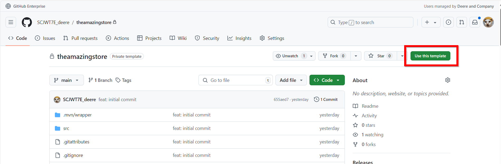
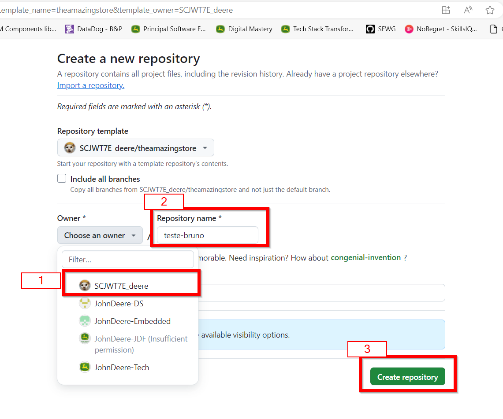
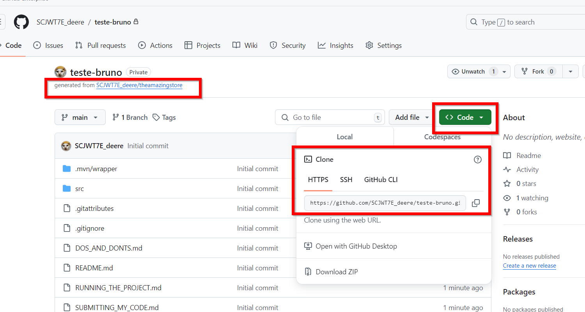
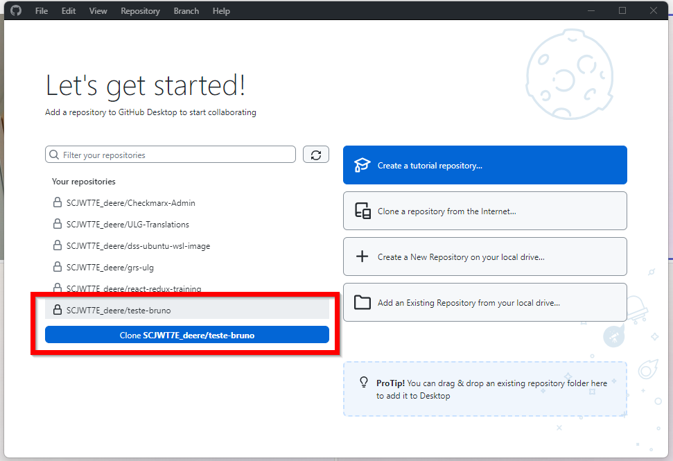
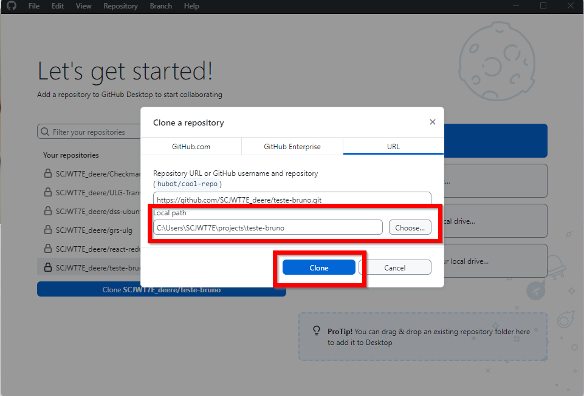
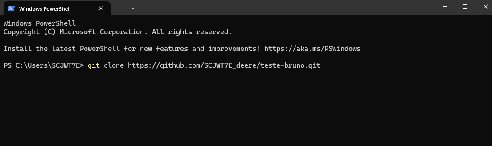

# Cloning the repo
Before you start, make sure you have Git setup on your machine. You can download it [**here**](https://github.com/git-for-windows/git/releases/download/v2.47.0.windows.2/Git-2.47.0.2-64-bit.exe).
<br>Or, you can make use of the GUI tools available, like:
- Git Fork
- GitHub Desktop

## Steps
1. Open the repository on [**GitHub.com**](https://github.com/SCJWT7E_deere/theamazingstore) or on [**GitHub.deere.com**]()
2. Click on "Use this template" button 
3. Create a new repository from the template. It must be created in your GitHub account (do not use any John Deere organization) and add a creative name to it! 
4. Click on "Code" to clone your newly created repository (NOT THE TEMPLATE!!!) to your local machine 
   - Example using CLI: ```git clone https://github.com/SCJWT7E_deere/teste-bruno.git```
5. Open the project in your favorite IDE and start working on the solutions to make the tests pass! 🚀

## Cloning from GitHub Desktop
**If you already created the repo from the template, it'll appear on the repositories list for your account**:


Remember the folder you used to clone the repository, as you'll need it to open the project in your IDE.

## Cloning from CLI
1. **AFTER YOU INSTALLED GIT ON YOUR MACHINE**, open your terminal (cmd/git bash/powershell)
2. Copy the url from [Step 4](#steps), type ``git clone ``and paste it in the terminal !<br>```git clone https://github.com/<your-user-id>/<repo-name>.git``` 
3. Hit enter and wait for the repository to be cloned to your machine! **Remember the folder you ran git clone, you'll need it to commit you changes**
4. Open the project in your favorite IDE and start working on the solutions to make the tests pass! 🚀
### P.S.: A window may appear to config the clone if you clone using HTTPS. Just hit enter to proceed.


