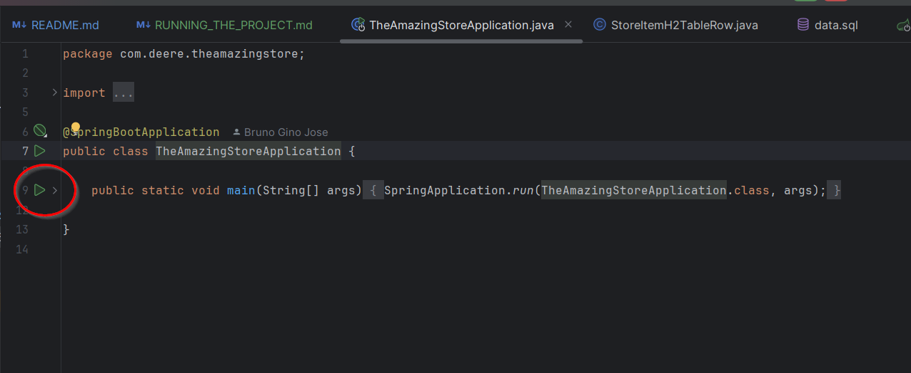

# Running the project
To run the project, you must have the following tools installed:
- [Java 21](#installing-java-21-)
- An IDE ([IntelliJ IDEA](#running-the-project---intellij-idea---alternative-1), [Eclipse](#running-the-project---eclipse), etc)
- [Maven](#installing-maven) (_**you may not need to install Maven if you're using IntelliJ IDEA**_ ⚠️)
- [An HTTP client](#installing-an-http-client) 

## Installing Java 21 ☕
You can download an installation of Java 21 from the Amazon Corretto website [here](https://corretto.aws/downloads/latest/amazon-corretto-21-x64-windows-jdk.msi).
<br>
Hit **next** until the installation is complete.

## Installing Maven
You can download an installation of Maven from the Apache Maven website [here](https://maven.apache.org/download.cgi).<br>
Extract the contents of the ``.zip`` file to a directory of your choice and add the path to the ``bin`` folder to your system's PATH environment variable:
1. From Windows search, open **Edit environment variables**
2. Click on **Environment Variables...**
3. In the **System variables** section, select the **Path** variable and click **Edit...**
4. Click **New** and paste the path to the ``bin`` folder of the Maven installation directory
5. Click **OK** on all windows
6. Open a new terminal and type ``mvn -v`` to check if Maven was installed correctly
7. Restart your IDE to be able to use Maven from the IDE's terminal


## Setting up Java 21 in IntelliJ IDEA
1. Open IntelliJ IDEA
2. Go to **File** > **Project Structure**
3. In the **SDK** field, click on the **Add JDK from disk...** button
4. Navigate to the directory where you installed Java 21 and select the folder (if you chose the default installation path it'll be under ```C:\Program Files\Amazon Corretto\jdk21.0.5_11```)
5. Click **OK** and then **Apply**
6. In the **Language Level** field, select **21 - Switch expressions, text blocks**
7. Navigate to **Modules** on the left side menu
8. In the **Sources** tab, set the **Language level** to **21 - Switch expressions, text blocks**
9. Click **Apply** and then **OK**

## Setting up Java 21 in Eclipse
1. Open Eclipse
2. Go to **Window** > **Preferences**
3. In the **Java** section, click on **Installed JREs**
4. Click on **Add...**
5. Select **Standard VM** and click **Next**
6. In the **JRE home** field, click on **Directory...** and navigate to the directory where you installed Java 21 (if you chose the default installation path it'll be under ```C:\Program Files\Amazon Corretto\jdk21.0.5_11```)
7. Click **Finish**


## Installing the project dependencies - IntelliJ IDEA
1. Open IntelliJ IDEA
2. On the right side menu click on **Maven** > **TheAmazingStore** > **Lifecycle** > **install**
3. Wait for the dependencies to be installed
4. Or, go to pom.xml and click on the **Reimport** button that appears in the top right corner of the file
5. Or, open the terminal and type ``mvn install``

## Installing the project dependencies - Eclipse
1. Open Eclipse
2. Right-click on the project folder and go to **Run As** > **Maven install**
3. Wait for the dependencies to be installed
4. Or, go to the project folder, right-click on **pom.xml** and go to **Maven** > **Update Project...**

## Installing an HTTP client
Feel free to install and use any tool you like to test the endpoints, like:
- [Postman](https://www.postman.com/)
- [Insomnia](https://insomnia.rest/)
- [Curl](https://curl.se/)
- [Bruno](https://www.usebruno.com/downloads)
- Or even the browser console itself

## Running the project - IntelliJ IDEA - Alternative 1
1. In the top right corner of the screen, click on the **Edit Configuration...** button
2. Click on the **+** button and select **Spring Boot**
3. In the **Name** field, type **TheAmazingStore**
4. In the **Main class** field, type **com.example.TheAmazingStore.TheAmazingStoreApplication**
5. In the **JRE** field, select **Amazon Corretto 21**
6. Click **Apply** and then **OK**
7. Click on the green play button or on the green debug button to run the project

## Running the project - IntelliJ IDEA - Alternative 2
1. Open the [main class](./src/main/java/com/deere/theamazingstore/TheAmazingStoreApplication.java)
2. Click on the green play button on the left side of the main method to run the project 

## Running the project - Eclipse
1. Right-click on the project folder and go to **Run As** > **Spring Boot App**
2. Or, right-click on the project folder and go to **Run As** > **Java Application**
3. In the **Main class** field, type **com.example.TheAmazingStore.TheAmazingStoreApplication**
4. Click **OK**
5. Click on the green play button or on the green debug button to run the project

