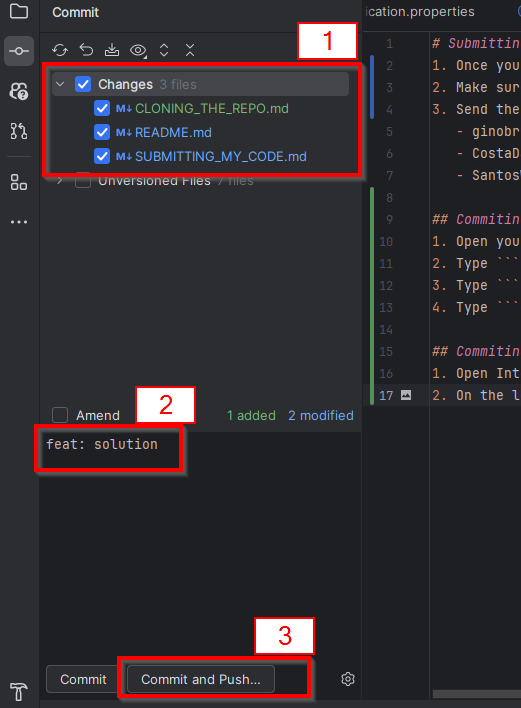
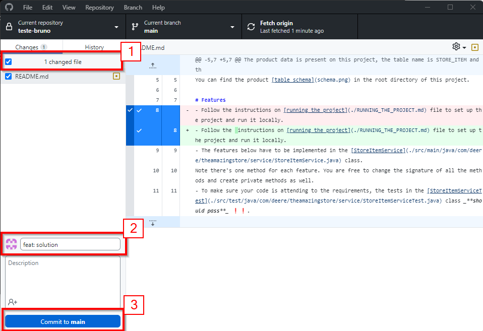
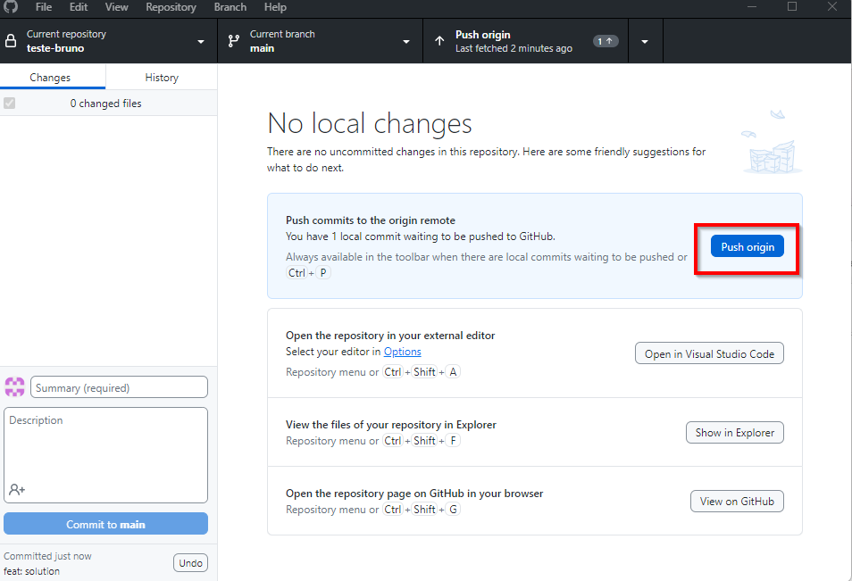
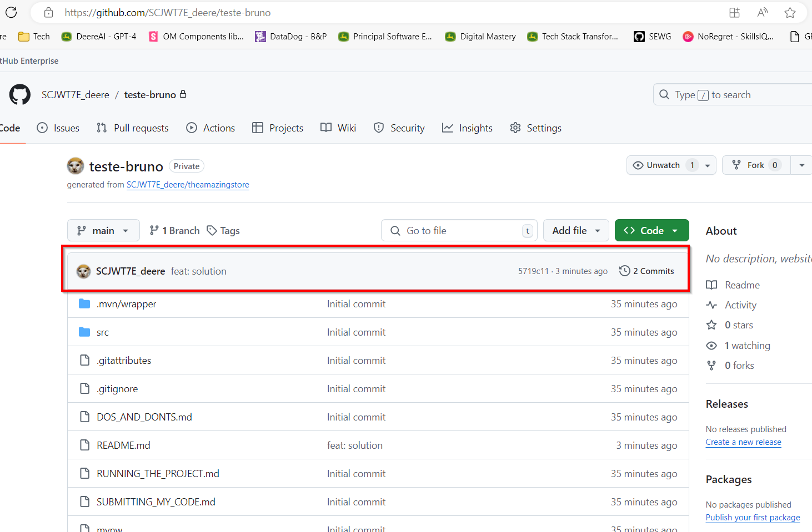

# Submitting my code 👩‍💻
1. Once you finish, commit to your repository and push the changes to your repository
2. Make sure your repo is public so we can view your code
3. Send the link to your repository to the following email addresses with the subject "Tech Challenge JR. Software Engineer - [Your Name Here]":
   - ginobruno@johndeere.com
   - CostaDaniel@JohnDeere.com
   - SantosWandersonO@JohnDeere.com

Having trouble with the steps above? _**Check the instructions below to commit and push your changes**_ 👇

## Commiting from CLI
1. Open your terminal (cmd/git bash/powershell) in the project folder
2. Type ```git add .``` to stage all the changes
3. Type ```git commit -m "Your commit message here"``` to commit the changes
4. Type ```git push``` to push the changes to your repository

## Commiting from IntelliJ
1. Open IntelliJ IDEA
2. On the left side menu click on **Commit**(Alt + 0) 
3. Click on the checkbox on the left side of "Changes"
4. Add a commit message
5. Click on *Commit and Push...* to commit and push your changes to the repository

## Commiting from GitHub Desktop
1. Open GitHub Desktop
2. Click on the checkbox in the top left corner to select all your changes 
3. Add a commit message as in the screenshot above and click on "Commit to main"
4. After you commit click on "Push origin" to push the changes to your repository 
5. Check you commit on the remote repository to make sure it was pushed correctly 